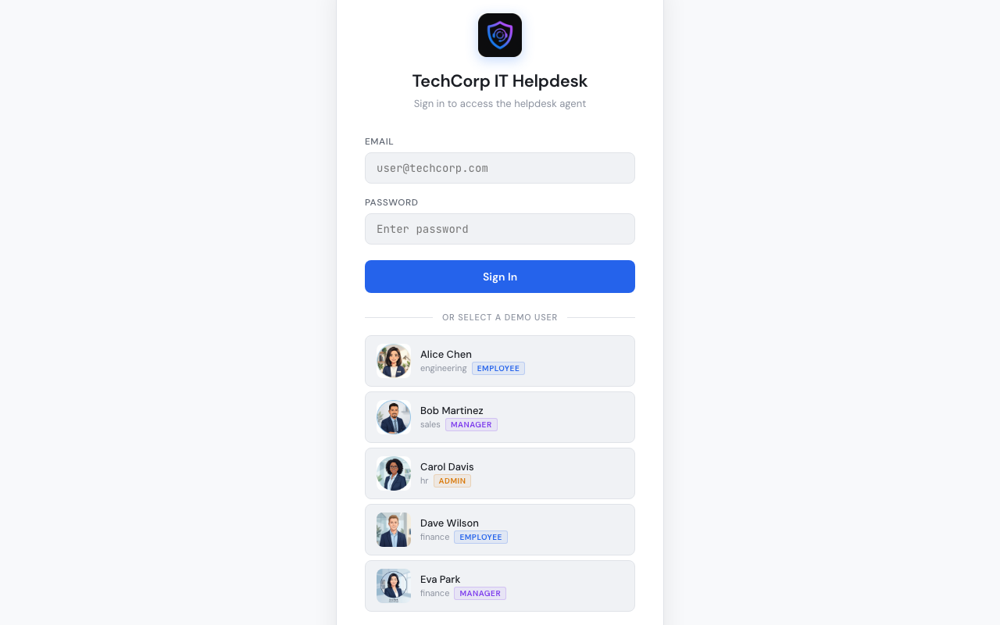
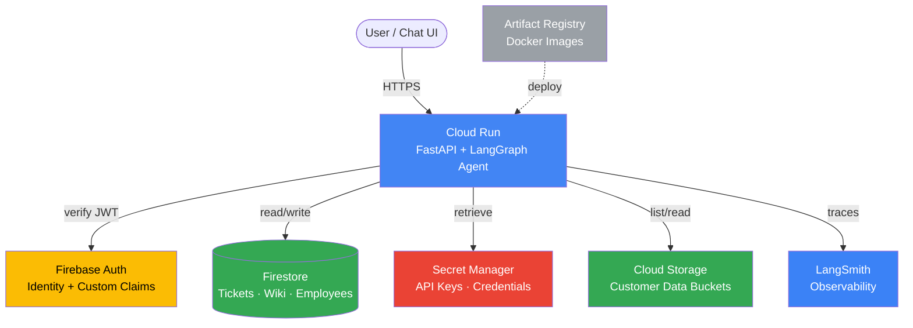
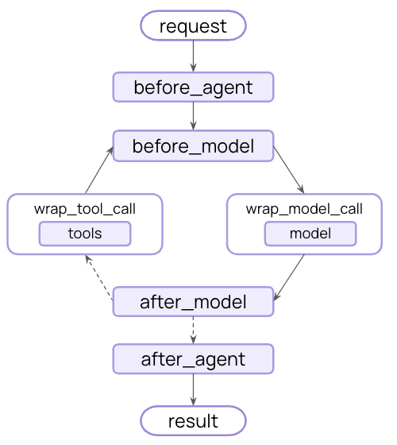

# AI Agent Security Techniques: Real World Attacks with Production Grade Defenses

<p align="center">
  <a href="https://www.langchain.com/"></a>
  &nbsp;&nbsp;&nbsp;&nbsp;
  <a href="https://www.langchain.com/langgraph"></a>
  &nbsp;&nbsp;&nbsp;&nbsp;
  <a href="https://smith.langchain.com/"></a>
</p>
<p align="center"><em>Based on LangChain &middot; LangGraph &middot; LangSmith</em></p>

AI agents are shipping to production faster than teams can secure them. The same vulnerabilities keep showing up: agents that reset passwords for the wrong user, leak customer data across tenants, or follow instructions planted in database records. Most of these aren't sophisticated attacks. They're the predictable result of skipping security fundamentals in the rush to deploy.

This repository is a hands-on breakdown of how AI agents break and how to fix them. Six progressive demos, each targeting a real attack vector from production deployments, fixed by building real **security architecture for agents** with **[LangChain middleware](https://docs.langchain.com/oss/python/langchain/middleware/overview)**: composable hooks that intercept every model call and tool execution in the agent loop, enforcing security without modifying core agent logic. Built with **[LangChain](https://docs.langchain.com/)** + **[LangGraph](https://langchain-ai.github.io/langgraph/)**, deployed on GCP Cloud Run with Firebase Auth and Firestore. Every agent run is observable via **[LangSmith](https://smith.langchain.com/)** tracing.

Every attack is runnable. Every fix is verifiable. No slides, no theory, just code.

<p align="center">
  
</p>

> [!WARNING]
> **For educational and defensive-security purposes only.** This repository
> demonstrates real attacks against AI agents so engineers can learn to defend
> against them. The vulnerabilities are intentional and the exploits run against
> a sandboxed demo application (TechCorp) that you deploy to your own isolated
> cloud project. Do **not** use these techniques against any system you do not
> own or are not explicitly authorized to test. You are solely responsible for
> how you use this material; the author accepts no liability for misuse or for
> any damage resulting from it. By using this repository you agree to comply with
> all applicable laws and to follow responsible-disclosure practices.

## Who This Is For

- Engineers building or deploying AI agents who want to understand the real attack surface
- Platform and security teams evaluating agent risks before shipping to production
- Anyone who's read about prompt injection but never exploited one hands-on

## The 6 Attack Vectors

Each demo follows the same pattern: **attack** the agent, **prove** the damage, **apply** the fix, **verify** the fix holds.

| # | Attack Vector | What Happens | The Fix | OWASP LLM |
|---|--------------|-------------|---------|-----------|
| 1 | [**Blast Radius**](modules/01-agent-security/demos/01-blast-radius/) | Prompt injection resets another user's password and exfiltrates GCP secrets | `ToolFilterMiddleware` + least-privilege service account | LLM01, LLM06 |
| 2 | [**Tenant Isolation**](modules/01-agent-security/demos/02-tenant-isolation/) | Employee reads HR salary data with a natural-sounding request (no injection needed) | `AuthorizationMiddleware`: RBAC from verified Firebase JWT | LLM02, LLM06 |
| 3 | [**Indirect Injection**](modules/01-agent-security/demos/03-indirect-injection/) | Poisoned ticket description hijacks the agent to leak budget data using a manager's privileges | `SanitizationMiddleware`: tool call validation + data boundaries | LLM01, LLM05 |
| 4 | [**Memory Poisoning**](modules/01-agent-security/demos/04-memory-poisoning/) | One chat message becomes a permanent backdoor that fires in every future session | `MemoryGuardMiddleware`: structured Pydantic schemas kill free-text injection | LLM01, LLM06 |
| 5 | [**Production Guardrails**](modules/01-agent-security/demos/05-production-guardrails/) | Sophisticated jailbreak bypasses keyword validation + PII leaks in agent responses | NeMo Guardrails: ML-based jailbreak detection + PII redaction | LLM01, LLM02 |
| 6 | [**Least Privilege**](modules/01-agent-security/demos/06-least-privilege/) | Over-privileged GCP service account exposes storage buckets and secrets | Infrastructure-level fix: least-privilege service account | LLM06 |

Each attack is modeled on vulnerabilities found in production agent deployments, not contrived examples.

## OWASP LLM Top 10 Coverage

Mapped to the [OWASP Top 10 for LLM Applications](https://genai.owasp.org/llm-top-10/). These are the categories this course attacks and defends hands-on:

| OWASP LLM | Category | Demos |
|-----------|----------|-------|
| LLM01 | Prompt Injection | 1, 3, 4, 5 |
| LLM02 | Sensitive Information Disclosure | 2, 5 |
| LLM05 | Improper Output Handling | 3 |
| LLM06 | Excessive Agency | 1, 2, 4, 6 |

## Quick Start

All commands below run from `modules/01-agent-security/`. About 10 minutes to a running agent on real GCP services.

```bash
cd modules/01-agent-security

# 1. Configure environment
cp .env.example .env              # Edit .env: set all required variables (see .env.example)

# 2. Authenticate with GCP
gcloud auth application-default login
gcloud config set project YOUR_PROJECT_ID

# 3. Set up Firebase (one-time, required for Chat UI authentication):
#    a. Go to https://console.firebase.google.com
#    b. Click "Add project" > select your GCP project
#    c. Go to Build > Authentication > Get Started > enable "Email/Password" provider
#    d. Go to Project Settings > General > copy the "Web API Key"
#    e. Add to .env: FIREBASE_API_KEY=your-api-key-here

# 4. Deploy (builds Docker image, provisions infra, seeds data)
bash deploy_gcloud.sh

# 5. Open the Chat UI at the AGENT_URL printed by the deploy script
#    Sign in as Alice > type the Demo 1 attack prompt > watch the agent reset Bob's password
```

See the [Module 01 README](modules/01-agent-security/README.md) for architecture details, the full demo flow, Chat UI features, and environment reference.

## Infrastructure

All demos and lessons run on GCP with real services. No emulators, no mocks.



Deployment is a single script (`deploy_gcloud.sh`). No Terraform required.

## Prerequisites

| Tool | Install | Verify |
|------|---------|--------|
| uv (package manager) | [docs.astral.sh/uv](https://docs.astral.sh/uv/getting-started/installation/) | `uv --version` |
| Docker | [docker.com](https://docs.docker.com/get-docker/) | `docker --version` |
| Google Cloud account | [cloud.google.com](https://cloud.google.com/) | `gcloud auth list` |
| gcloud CLI | [cloud.google.com/sdk](https://cloud.google.com/sdk/docs/install) | `gcloud --version` |
| OpenAI API key | [platform.openai.com/api-keys](https://platform.openai.com/api-keys) | |

## Built on the LangChain stack

<p align="center">
  <a href="https://www.langchain.com/"></a>
  &nbsp;&nbsp;&nbsp;
  <a href="https://www.langchain.com/langgraph"></a>
  &nbsp;&nbsp;&nbsp;
  <a href="https://smith.langchain.com/"></a>
</p>

Every security fix in this repo is a single LangChain middleware class. The diagram below is the real agent loop: each demo's defense plugs into one of those hooks (`wrap_tool_call`, `before_model`, `after_model`) without forking the agent or rewriting the loop. `create_agent()` compiles the whole thing into a LangGraph state graph (the ReAct loop, tool routing, and state handled for you), and every run is traced end to end in LangSmith. This is what security architecture for agents looks like: defenses living inside the agent's architecture as clean, composable layers instead of a patchwork bolted on top, exactly the foundation production agents have been missing.

<p align="center">
  <a href="https://docs.langchain.com/oss/python/langchain/middleware/overview"></a>
</p>
<p align="center"><sub>The LangChain agent loop and its middleware hooks. Diagram from the <a href="https://docs.langchain.com/oss/python/langchain/middleware/overview">LangChain middleware docs</a>.</sub></p>

## Contributing

Contributions are welcome. This is a teaching repository, so the bar for changes
is clarity and correctness over feature breadth:

- **Found a bug or a broken demo?** Open an issue describing the demo, the
  expected vs. actual behavior, and your environment.
- **Improving a defense or adding an attack vector?** Open an issue first to
  discuss the approach before sending a PR, so it fits the demo's attack > prove
  > fix > verify structure.
- **Fixing docs or typos?** Send a PR directly.

Please keep examples runnable and aligned with the existing middleware pattern
(one security fix = one composable LangChain middleware class). Do not submit
exploits targeting real third-party systems.

Security note: if you discover a genuine vulnerability in the demo
infrastructure itself (not the intentional teaching vulnerabilities), please
report it privately rather than opening a public issue.

## Built By

**Eden Marco** | Focused on AI agent security in cloud-native environments. Built this after seeing the same agent vulnerabilities across too many production deployments, to show how it's done right: every attack, every fix, running on real infrastructure.

[](https://www.linkedin.com/in/eden-marco/) [](https://x.com/EdenEmarco177) [](https://www.udemy.com/user/eden-marco/)
