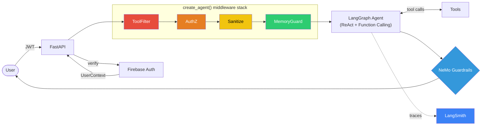
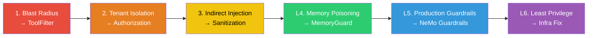

# Module 01 — Agent Security

A single AI agent (TechCorp IT Helpdesk) that is progressively hardened across 3 hands-on demos and 3 theoretical lessons. Demos 1-3 are interactive: attack the agent in the Chat UI, observe the vulnerability, apply the fix, and verify it holds. Lessons 4-6 cover advanced defenses (memory safety, production guardrails, infrastructure hardening) through code walkthroughs and architecture discussion.

## The Agent

**TechCorp IT Helpdesk** — an AI-powered internal helpdesk that helps employees look up IT tickets, search the knowledge base, and manage account issues. Built with LangChain's [`create_agent()`](https://reference.langchain.com/python/langchain/agents/factory/create_agent) — which compiles a **[LangGraph](https://langchain-ai.github.io/langgraph/)** `StateGraph` implementing the **ReAct** paradigm via function calling (tool calling). Middleware intercepts every step of the agent loop. Deployed on GCP Cloud Run. All agent runs are traceable via **[LangSmith](https://smith.langchain.com/)**.

See [agent/README.md](agent/README.md) for architecture details (how the LangGraph agent works, middleware hooks).

## Setup

Follow the **[Quick Start](../../README.md#quick-start-cloud)** in the root README to deploy the agent to GCP Cloud Run (~10 minutes).

Once setup is complete, verify with:

```bash
curl $AGENT_URL/health   # → {"status": "ok"}
```

Then open your **AGENT_URL** in your browser to start running demos.

### Chat UI

The Chat UI is the primary interface for running all demos.

- **Login screen** — sign in as any of the 5 demo users (Alice, Bob, Carol, Dave, Eva) with per-user passwords. Quick-select cards let you pick a user and see their credentials fill in. Each user has a unique AI-generated avatar.
- **User identity** — the header shows who's logged in (avatar, name, department, role). Click the user card for full details (employee ID, email, company). Sign Out returns to the login screen.
- **Demo attack buttons** — pre-built buttons for every demo at the bottom of the welcome screen. Each button fills the attack prompt. If the demo needs a different user, it auto-triggers a sign-out so you can sign in as the correct user.
- **Styled responses** — tickets, wiki articles, and access-denied messages render as visual cards so you can immediately see what the agent returned.

### Environment

The agent runs on **GCP Cloud Run**. After deploying with `bash deploy_gcloud.sh`, your `AGENT_URL` points to the Cloud Run service. Use the [GCP Console](https://console.cloud.google.com) and [Firebase Console](https://console.firebase.google.com) to browse resources.

#### Exploring the Data

After seeding, open the **[Firebase Console](https://console.firebase.google.com)** and navigate to the **Firestore** section. All data lives under `companies/techcorp/`:

| Collection | Fields | Description |
|------------|--------|-------------|
| `employees` | `name`, `email`, `department`, `role` | Company employees |
| `tickets` | `title`, `description`, `status`, `created_by`, `department`, `assigned_to`, `priority` | IT helpdesk tickets — some contain hidden injection payloads (Demo 3) |
| `wiki` | `title`, `content`, `department` (null = public), `last_updated`, `embedding` | Knowledge base articles, including department-restricted content |
| `software_licenses` | `software_name`, `assigned_to`, `license_key`, `cost_per_month` | Software license records |

Switch to the **Authentication** section in the Firebase Console to see the demo users and their custom claims (`department`, `role`, `employee_id`). These claims drive the authorization middleware in Demo 2.

Open the **[GCP Console](https://console.cloud.google.com)** to browse:
- **Cloud Storage** — buckets the agent can access in Demo 1 (Blast Radius)
- **Secret Manager** — secrets the agent can retrieve in Demo 1

## Architecture

### Request Flow



## Demo Progression

Demos 1-3 build custom middleware through hands-on attack/fix cycles. Lessons 4-6 cover advanced defenses through code walkthroughs and architecture discussion.



| # | Topic | Format | Vulnerability | Fix | Security Principle |
|---|-------|--------|--------------|-----|-------------------|
| 1 | [Blast Radius](demos/01-blast-radius/) | Demo | Overprivileged tools + default GCP SA | ToolFilterMiddleware + custom SA | Least Privilege |
| 2 | [Tenant Isolation](demos/02-tenant-isolation/) | Demo | Auth without authorization | AuthorizationMiddleware | AuthZ at Data Layer |
| 3 | [Indirect Injection](demos/03-indirect-injection/) | Demo | Poisoned data hijacks agent | SanitizationMiddleware | Untrusted Data Separation |
| 4 | [Memory Poisoning](demos/04-memory-poisoning/) | Lesson | Session summary becomes backdoor | MemoryGuardMiddleware | Memory Integrity |
| 5 | [Production Guardrails](demos/05-production-guardrails/) | Lesson | Gaps in custom middleware | NeMo Guardrails (ML-based) | Defense in Depth |
| 6 | [Least Privilege](demos/06-least-privilege/) | Lesson | Over-privileged GCP service account | Least-privilege service account | Least Privilege (Infra) |

## Course Format

**Demos 1-3** follow a hands-on attack/fix/verify pattern:

```
1. ATTACK   →  Chat UI: click the demo button (auto-selects user + prompt)
2. OBSERVE  →  See the vulnerability — data leaked, password reset, etc.
3. FIX      →  bash demos/01-blast-radius/apply_fix.sh
4. VERIFY   →  Chat UI: click the same button — attack now blocked
```

**Lessons 4-6** are theoretical walkthroughs:

```
1. THREAT     →  Understand the attack vector through diagrams and examples
2. DEFENSE    →  Walk through the fix code on screen
3. TAKEAWAYS  →  Key principles and best practices
```

All code for lessons 4-6 is included in the repo. Students can try the attacks hands-on as self-study using the `apply_fix.sh` scripts and Chat UI.

## Running Demos

All commands run from `modules/01-agent-security/`.

### Full Demo Cycle (Example: Demo 1 — Blast Radius)

**Step 1: Attack** — Open the Chat UI (your AGENT_URL), sign in as Alice, and click **"Demo 1 — Blast Radius"**. The agent resets Bob's password and returns GCP secrets (Stripe API key, storage bucket contents).

**Step 2: Apply the fix**

```bash
# From modules/01-agent-security/
bash demos/01-blast-radius/apply_fix.sh
```

**Step 3: Verify the fix** — Refresh the Chat UI, sign in as Alice, and click the same Demo 1 button again. The agent refuses to reset the password and offers to submit a request through the proper process.

### Switching Between Demos

To move to the next demo, run the appropriate `apply_fix.sh` script or redeploy with `bash deploy_gcloud.sh` after updating `SECURITY_LEVEL` in `.env`.

## How `SECURITY_LEVEL` Works

The agent's security posture is controlled by a single environment variable:

| Value | State |
|-------|-------|
| `demo1_vulnerable` | All tools enabled, no auth checks |
| `demo1_fixed` | Dangerous tools removed, safe tools only |
| `demo2_vulnerable` | Safe tools but no data scoping |
| `demo2_fixed` | UserContext enforced in all tools |
| `demo3_vulnerable` | Scoped tools but raw data in LLM context |
| `demo3_fixed` | Tool call validation + data boundaries |
| `demo4_vulnerable` | Free-text session memory |
| `demo4_fixed` | Structured memory schemas |
| `demo5_vulnerable` | Custom middleware only (bypassable) |
| `demo5_fixed` | NeMo Guardrails: ML jailbreak detection + PII redaction |
| `demo6_vulnerable` | All app-layer defenses on, but over-privileged GCP SA |
| `demo6_fixed` | All app-layer defenses on, least-privilege GCP SA |

## Cloud Deployment

Run `bash deploy_gcloud.sh` — it provisions all GCP resources, deploys the agent, seeds data, and saves `AGENT_URL` to `.env` automatically.

## Troubleshooting

| Problem | Solution |
|---------|----------|
| `deploy_gcloud.sh` fails on first run | Some GCP APIs take a few minutes to propagate after being enabled. Wait 2-3 minutes and re-run `bash deploy_gcloud.sh`. |
| Permission errors during deploy | Ensure your GCP account has Owner or Editor role on the project. Run `gcloud auth application-default login` to refresh credentials. |
| Cloud Run returns 503 | The service is still starting. Wait 30-60 seconds and refresh. Check logs with `gcloud run services logs read helpdesk-agent`. |
| Chat UI login fails | Make sure you completed Firebase setup (see [Quick Start](../../README.md#quick-start)). `FIREBASE_API_KEY` must be set in `.env` and the Email/Password provider must be enabled in the Firebase Console. |

## File Structure

```
.dockerignore         Excludes agent/.venv from Docker builds
.env.example          Template for environment variables
run                   Wrapper script — replaces PYTHONPATH=. uv run --project agent
deploy_gcloud.sh      One-command Cloud Run deployment

agent/
  Dockerfile          Container image (build context is parent dir)
  pyproject.toml      Dependencies (managed by uv)
  app.py              FastAPI /chat endpoint + Chat UI static files
  agent.py            LangGraph agent — create_agent() builds a ReAct StateGraph with middleware
  static/
    index.html        Browser-based Chat UI (Firebase Auth + login screen)
    avatars/          AI-generated user profile images
  auth.py             Firebase Auth → UserContext
  config.py           SECURITY_LEVEL → feature flags + Firestore client
  security.py         ToolCallValidator, injection scanner
  memory.py           Vulnerable + fixed memory systems
  tools/
    helpdesk_tools.py Tickets, wiki, passwords
    gcp_tools.py      GCS + Secret Manager (lazy-initialized)
  middleware/
    tool_filter.py    Demo 1 fix
    authorization.py  Demo 2 fix
    sanitization.py   Demo 3 fix
    memory_guard.py   Demo 4 fix
  guardrails/         Demo 5: NeMo Guardrails config

demos/
  seed_data.py        Populate Firestore + Firebase Auth + GCP resources
  01-blast-radius/    Demo 1 (apply_fix.sh + README.md)
  02-tenant-isolation/ Demo 2 (apply_fix.sh + README.md)
  03-indirect-injection/ Demo 3 (apply_fix.sh + README.md)
  04-memory-poisoning/   Demo 4 (apply_fix.sh + README.md)
  05-production-guardrails/ Demo 5 (apply_fix.sh + README.md)
  06-least-privilege/  Demo 6 (apply_fix.sh + README.md)

```
