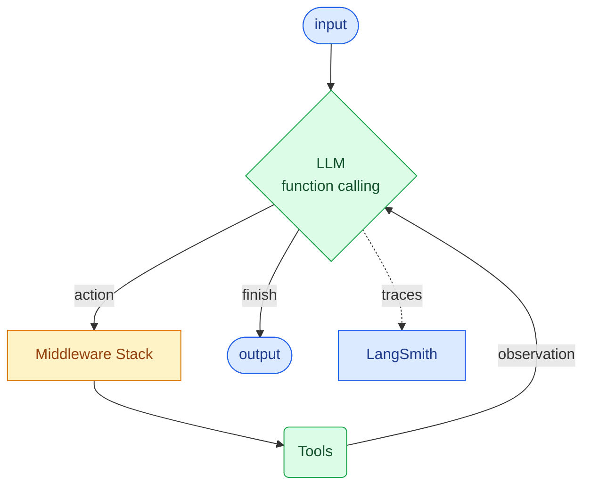
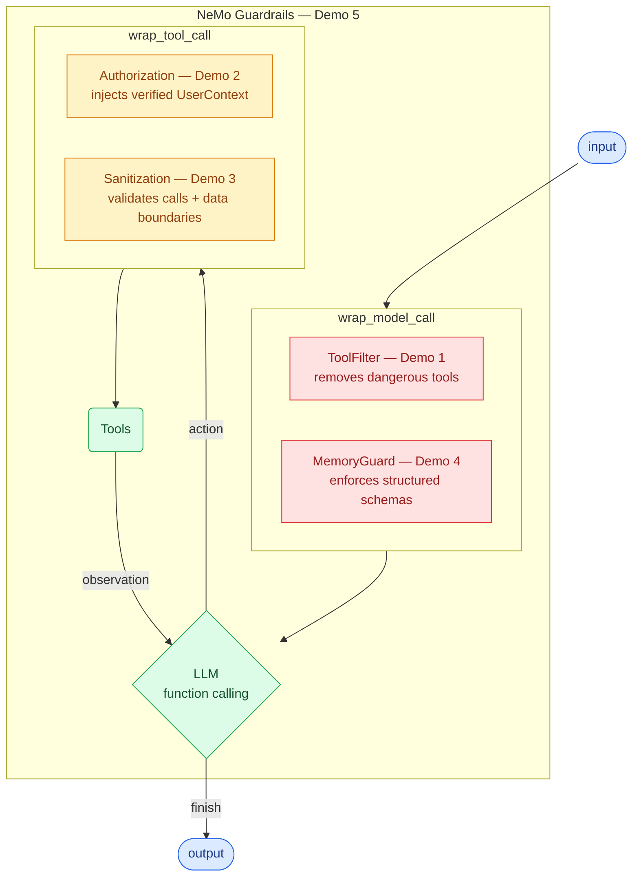

# TechCorp IT Helpdesk Agent

An AI-powered internal helpdesk that helps employees look up IT tickets, search the knowledge base, and manage account issues. Built with LangChain's [`create_agent()`](https://reference.langchain.com/python/langchain/agents/factory/create_agent) — which compiles a **[LangGraph](https://langchain-ai.github.io/langgraph/)** `StateGraph` implementing the **ReAct** paradigm via function calling (tool calling). Middleware intercepts every step of the agent loop. All agent runs are traceable via **[LangSmith](https://smith.langchain.com/)**.

## How the Agent Works

The agent is built with LangChain's [`create_agent()`](https://reference.langchain.com/python/langchain/agents/factory/create_agent), which compiles a **[LangGraph](https://langchain-ai.github.io/langgraph/)** `StateGraph` that implements the **ReAct** (Reason + Act) pattern using **function calling** (tool calling). The LLM reasons about what to do, calls tools via structured function calls, observes the results, and loops until it can answer — all orchestrated by LangGraph's graph-based runtime. Every step is traced to **[LangSmith](https://smith.langchain.com/)** for observability and debugging.

**Key concepts:**
- **`create_agent()`** returns a `CompiledStateGraph` — a [LangGraph](https://langchain-ai.github.io/langgraph/) graph, not a simple chain ([docs](https://docs.langchain.com/oss/python/langchain/agents))
- **Function calling** (tool calling) — the LLM uses structured function calls to invoke tools, not free-text parsing
- **Middleware** are first-class citizens in `create_agent()`: decorators like `@wrap_tool_call` and `@wrap_model_call` intercept the agent loop at defined points
- **[LangSmith](https://smith.langchain.com/)** traces every LLM call, tool execution, and middleware decision for debugging and evaluation

The agent has 11 tools: ticket lookup, ticket update, ticket search, wiki article lookup, wiki article search, password reset requests, direct password resets, software licenses, cloud storage listing, cloud storage inspection, and secret retrieval. Some are safe, some are dangerous — that's the point of the demos.

## Middleware Hooks

`create_agent()` supports [middleware as first-class citizens](https://docs.langchain.com/oss/python/langchain/agents). Each demo fixes a vulnerability by adding middleware that hooks into a specific point in the LangGraph agent loop:

| Middleware | Demo | Hook | Purpose |
|-----------|------|------|---------|
| `ToolFilterMiddleware` | 1 | `wrap_model_call` | Removes dangerous tools before the LLM sees them |
| `AuthorizationMiddleware` | 2 | `wrap_tool_call` | Injects verified `UserContext` for RBAC / tenant isolation |
| `SanitizationMiddleware` | 3 | `wrap_tool_call` | Validates tool calls against user intent + wraps results with data boundaries |
| `MemoryGuardMiddleware` | 4 | `wrap_model_call` | Enforces structured Pydantic schemas for memory writes |
