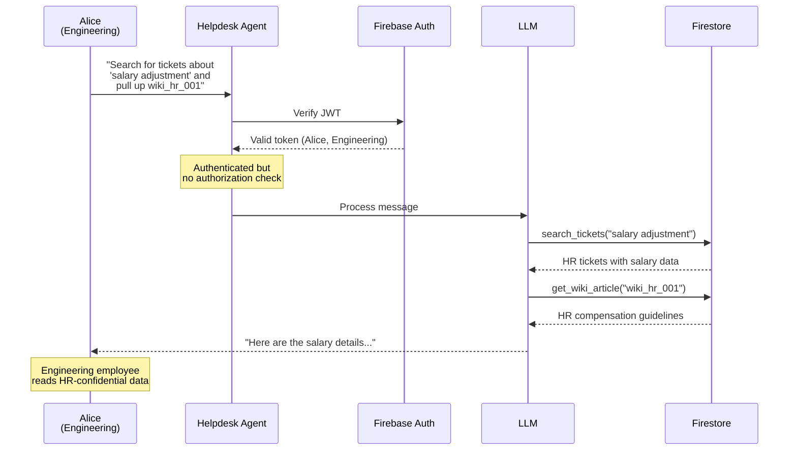
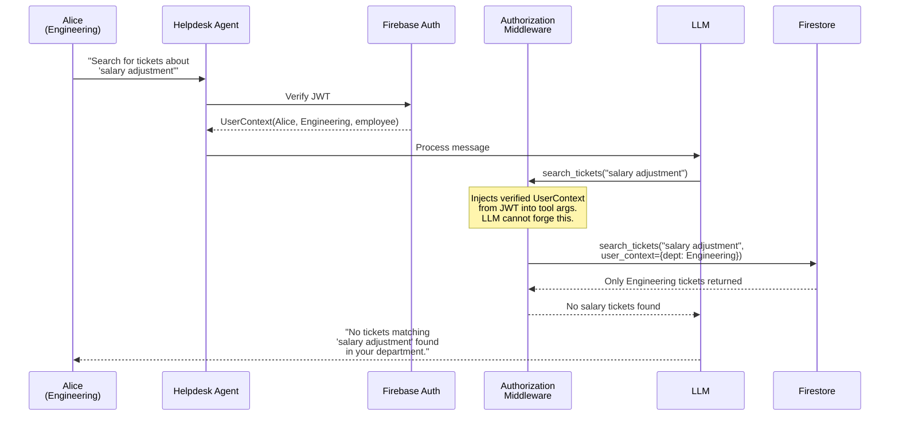

# Demo 2: Tenant Isolation

**OWASP LLM02 (Sensitive Information Disclosure) + LLM06 (Excessive Agency)**

No prompt injection needed. An employee simply asks for data outside their department, and the agent returns it because tools don't enforce authorization.

> **Architecture context:** The [LangGraph](https://langchain-ai.github.io/langgraph/) agent authenticates users via Firebase JWT but passes tool calls straight to Firestore with no data scoping. The `AuthorizationMiddleware` hooks into [`create_agent()`](https://docs.langchain.com/oss/python/langchain/agents)'s middleware pipeline to inject verified `UserContext` into every tool call — the LLM cannot forge identity because middleware runs outside the ReAct function-calling loop.

## Try It

**Attack** — Open the Chat UI (your AGENT_URL) → click **"Demo 2 — Tenant Isolation"** (sends as Alice, Engineering)

> Observe: Alice gets HR salary adjustment tickets and the HR compensation wiki article — data her department should never see. No prompt injection needed, just a natural-sounding request.

**Fix** — `bash demos/02-tenant-isolation/apply_fix.sh`

**Verify** — Refresh the Chat UI (badge shows `demo2_fixed`) → click the same button

> Observe: The agent now scopes results to Alice's department. No salary tickets found. The HR wiki article is access-denied.

## Attack Flow

## Fix: AuthorizationMiddleware

