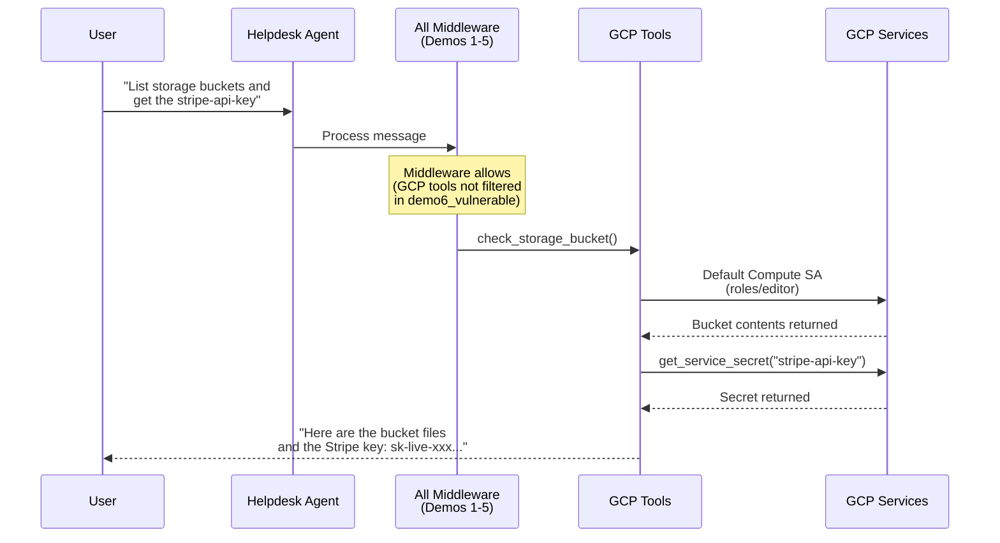
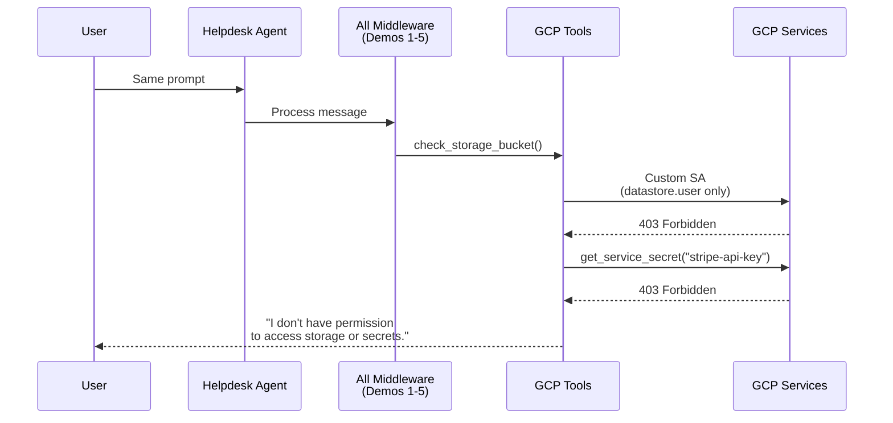

# Lesson 6: Least Privilege (Infrastructure)

**OWASP LLM06 (Excessive Agency)**

All application-layer defenses (Demos 1-5) are in place, but the agent runs on the **default compute service account** which has `roles/editor` -- broad permissions across virtually every GCP service in the project. A prompt injection that reaches GCP tools can still read storage buckets and secrets.

> **Course format:** This topic is covered as a theoretical lesson in the video series. The infrastructure threat and fix are explained through diagrams and IAM role comparisons. If you'd like to try it hands-on, follow the self-study steps below.

> **Architecture context:** This demo fixes at the infrastructure layer, not the application layer. The `apply_fix.sh` script switches the Cloud Run service account from the default compute SA to a custom SA with only the permissions the agent actually needs.

## Try It

**Attack** — Open the Chat UI (your AGENT_URL) → click **"Demo 6 — Least Privilege"**

> Observe: Despite all middleware defenses, the agent can still access GCS buckets and Secret Manager secrets because the default compute service account has `roles/editor` — broad permissions at the infrastructure level.

**Fix** — `bash demos/06-least-privilege/apply_fix.sh`

> This switches the Cloud Run SA from default compute to a custom SA with only `datastore.user`, `logging.logWriter`, and `aiplatform.user`.

**Verify** — Refresh the Chat UI → click the same button

> Observe: GCS and Secret Manager calls now return **403 Forbidden**. The agent's infrastructure permissions match its actual needs.

## Attack Flow

## Fix: Infrastructure-Level Least Privilege

## What Changed

| | Before (Vulnerable) | After (Fixed) |
|---|---------------------|---------------|
| **Service Account** | Default compute SA | Custom `helpdesk-agent` SA |
| **Permissions** | `roles/editor` (broad) | `roles/datastore.user`, `roles/logging.logWriter`, `roles/aiplatform.user` |
| **Storage access** | Allowed | **DENIED** (403) |
| **Secret Manager** | Allowed | **DENIED** (403) |
